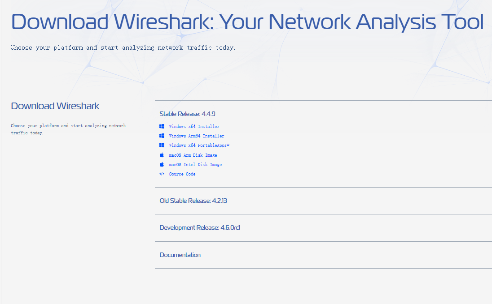
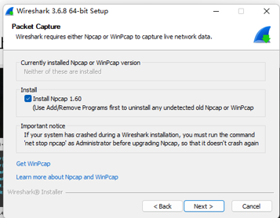
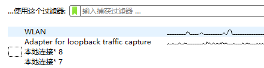
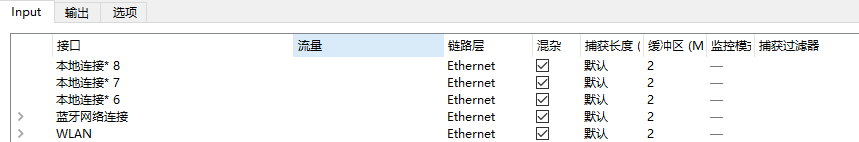

# Lab1 WireShark软件初探和常见网络命令的使用

## 1 WireShark 软件初探

### 1.1 安装

Wireshark 软件可通过 [官方链接](https://www.wireshark.org/download.html) 下载，
根据自己的操作系统选择对应的安装包即可。

在较新版 WireShark 的安装过程中，保持默认勾选安装即可。
如果你选择某些旧版本安装，请务必勾选 `Install Npcap`。
!!! quote ""
    新版默认安装，所以不会有勾选提示。

{style='height:70px'}&nbsp;&nbsp;
{style='height:70px'}

### 1.2 选择网络
打开 WireShark 后，界面会出现监测到的系统端口，选择其中一个端口就可以监测该接口的数据包流量。

或者也可以选择上方工具栏 捕获&rarr;选项 进行选择。

{style='height:70px'}&nbsp;&nbsp; 
{style='height:70px' align=right}

### 1.3 抓包
选定某一个端口进入后，抓包会自动进行。（请选择有流量的端口）。抓包界面如下：

    

在选择某一个包后可以在下方信息栏中查看具体信息

    

### 1.4 过滤器
WireShark 中过滤器主要有两种：**显示过滤器**和**捕获过滤器**。

他们主要功能都是筛选出符合条件的包，筛选条件可以是协议、地址等，也可以是它们的组合方式，善用过滤器可以快速帮助我们筛选想要的包。二者的功能差距请各位同学自行探索（思考题之一）。

    

        

            
 <b>显示过滤器</b>在选择端口进入之后，抓包界面的正上方
        

        
    

    

        

            
 <b>捕获过滤器</b>在上方工具栏 捕获&rarr;选项 选择端口界面的正下方
        

        
    

## 2 常见网络命令的使用
本次实验我们还需实际操作，熟悉一些常见的网络命令。理解其功能和应用场景，包括网络连接测试、路由查看、端口检查等，增强网络故障排查能力。

我们需要使用的命令主要包含以下 10 个：

|命令|功能说明|示例|图片示例|
|---|-|-|-|
| ping | 用于测试到特定地址的连通性、数据包的延迟时间 | `ping xxx` |  |
| ipconfig | 查看本机的网卡物理地址、IP地址 查看本机默认网关、DNS服务器地址 | `ipconfig/all` |  |
| arp | 显示本机记录的局域网内其它机器IP地址与其物理地址的对照表 | `arp -a` |  |
| tracert | 显示从本机到达一个特定地址的路由过程 | `tracert xxx` |  |
| nslookup | 显示某一个域名的 IP 地址 | `nslookup xxx` |  |
| nbtstat | 显示已经与本机建立TCP连接的端口、IP地址、连接状态等信息 | `nbtstat -n` |  |
| route | 显示本机的路由表信息 & 并手工添加一个路由 | `route print` &  `route add xxx mask mmm yyy` |  |
| netstat | 显示本机的网络映射连接 | `netstat -n` |  |
| NET SHARE | 显示局域网范围内某台机器的共享资源 | `NET SHARE` |  |
| telnet | 连接WEB服务器的端口获得该网站的主页内容 | `telnet xxx` `GET / HTTP/1.1` `HOST:xxx` |  |

!!! note
    - 上方表格示例部分均需要运行，其中 route 部分有两个指令执行两个