# Lab1 WireShark软件初探和常见网络命令的使用

## 1 WireShark 软件初探

Wireshark 是一款开源免费的网络协议分析工具，可以捕获并解析网络传输中的数据包，帮助用户直观地观察和研究各种协议的交互过程，常用于网络故障排查、学习协议原理以及安全分析等多种场景。

本次实验需要我们使用 WireShark 对网络数据进行抓包与分析，通过观察数据包的传输过程和协议内容，加深对网络通信机制的理解，同时熟悉 WireShark 工具的操作流程。

### 1.1 安装

Wireshark 软件可通过 [官方链接](https://www.wireshark.org/download.html) 下载，
根据自己的操作系统选择对应的安装包即可。

在较新版 WireShark 的安装过程中，保持默认勾选安装即可。
如果你选择某些旧版本安装，请务必勾选 `Install Npcap`。
!!! quote ""
    新版 WireShark 会默认安装，所以不会有勾选提示。

    

        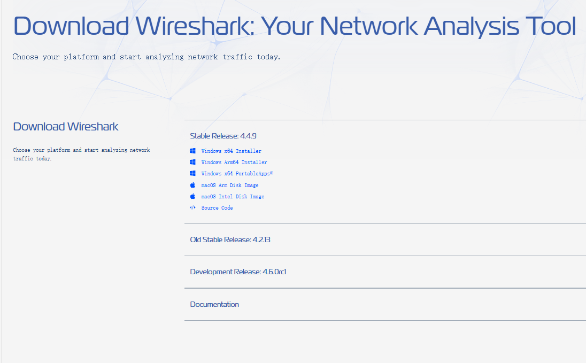
    

    

        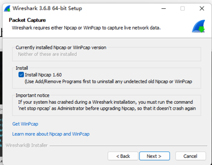
    

### 1.2 选择网络
打开 WireShark 后，界面会出现监测到的系统端口，选择其中一个端口就可以监测该端口的数据包流量。

或者也可以选择上方工具栏 **捕获&rarr;选项** 进行选择。

    

        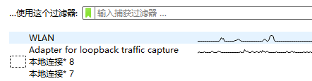
    

    

        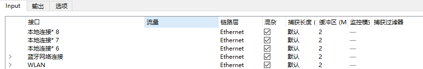
    

### 1.3 抓包
选定某一个端口进入后，抓包会自动进行。（请选择有流量的端口）。抓包界面如下：

    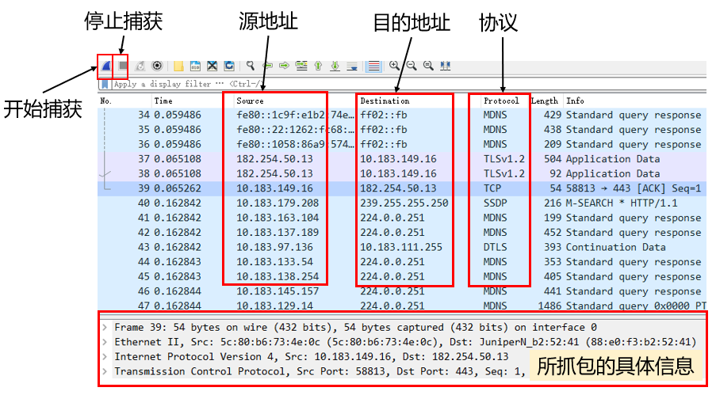

在选择某一个包后可以在下方信息栏中查看具体信息

    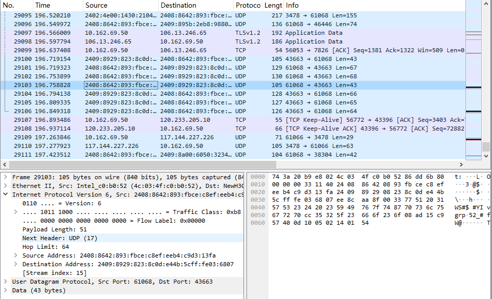

### 1.4 过滤器
WireShark 中过滤器主要有两种：**显示过滤器**和**捕获过滤器**。

他们主要功能都是筛选出符合条件的包，筛选条件可以是协议、地址等，也可以是它们的组合方式，善用过滤器可以快速帮助我们筛选想要的包。二者的功能差距请各位同学自行探索（思考题之一）。

    

        

            
 <b>显示过滤器</b>在选择端口进入之后，抓包界面的正上方
        

        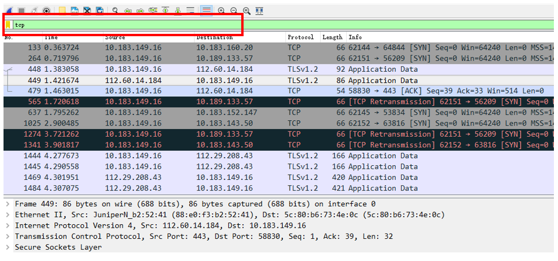
    

    

        

            
 <b>捕获过滤器</b>在上方工具栏 捕获&rarr;选项 选择端口界面的正下方
        

        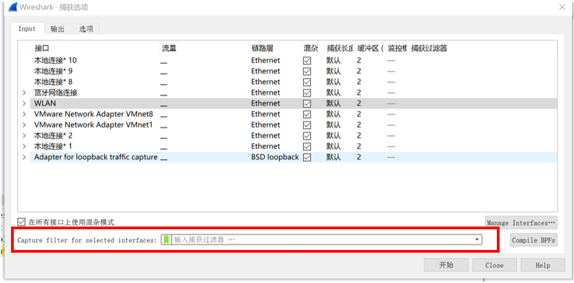
    

### 1.5 你的任务
- 你需要安装并熟悉 WireShark 的使用，可参照上方 WireShark 介绍，
- 操作过程、结果等需要截图保存，具体要求见实验报告模板。

## 2 常见网络命令的使用
本次实验我们还需实际操作并熟悉一些常见的网络命令。理解其功能和应用场景，包括网络连接测试、路由查看、端口检查等，增强网络故障排查能力。

在 windows 系统中我们一般在 `cmd` 或 `powershell` 执行命令，可以键入 `win + R` 再输入 `cmd` 或 `powershell` 打开终端。

我们需要使用的命令主要包含以下 11 个（命令名称10个，具体命令11个）：

|命令名称|功能说明|命令示例|图片示例|
|---|-|-|-|
| ping | 用于测试到特定地址的连通性、数据包的延迟时间 | `ping xxx` | 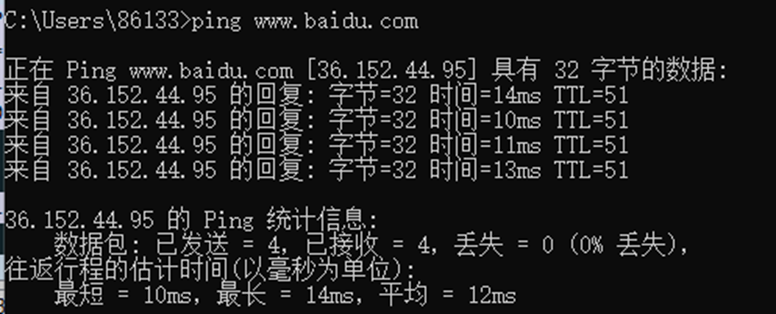 |
| ipconfig | 查看本机的网卡物理地址、IP地址 查看本机默认网关、DNS服务器地址 | `ipconfig/all` | 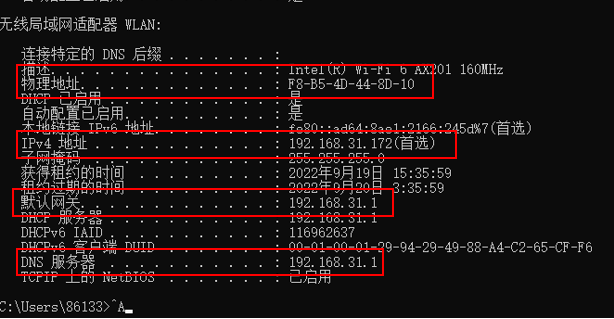 |
| arp | 显示本机记录的局域网内其它机器IP地址与其物理地址的对照表 | `arp -a` | 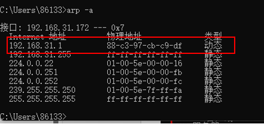 |
| tracert | 显示从本机到达一个特定地址的路由过程 | `tracert xxx` | 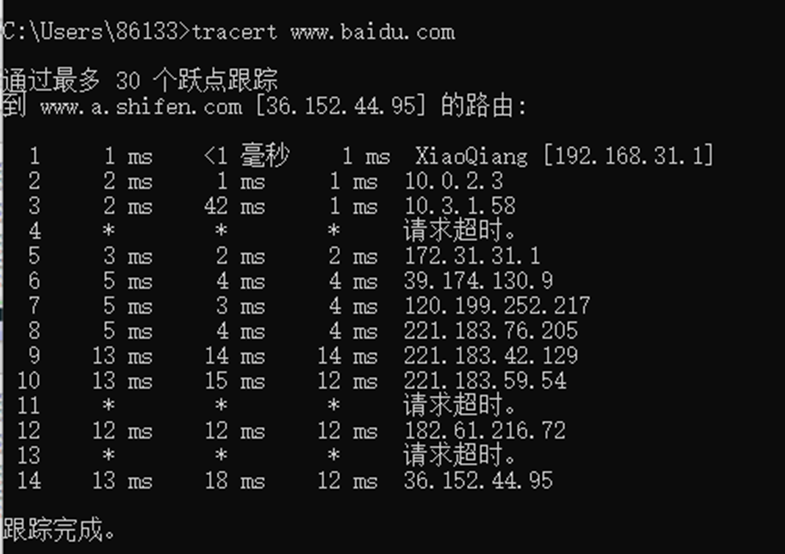 |
| nslookup | 显示某一个域名的 IP 地址 | `nslookup xxx` | 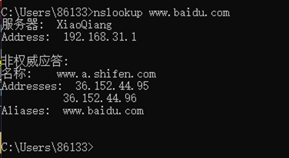 |
| nbtstat | 显示本机 NetBIOS 名称表 | `nbtstat -n` | 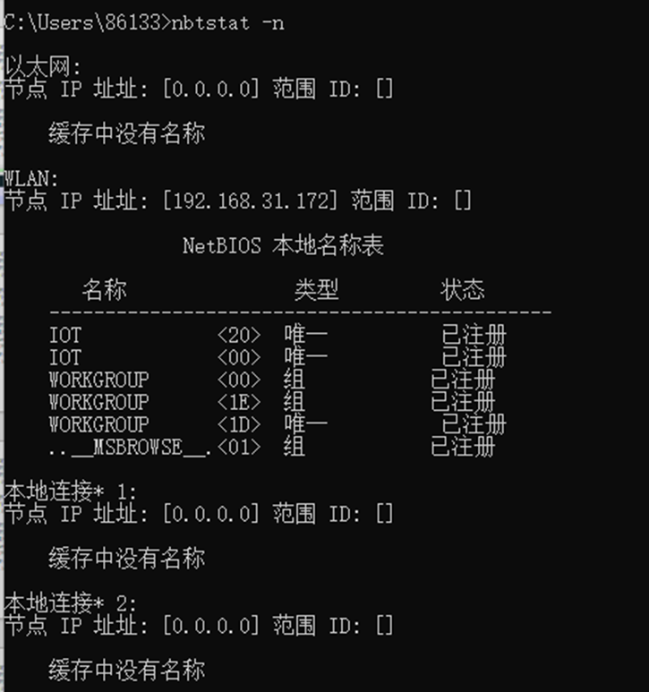 |
| route | 显示本机的路由表信息 & 并手工添加一个路由 | `route print` &  `route add xxx mask mmm yyy` | 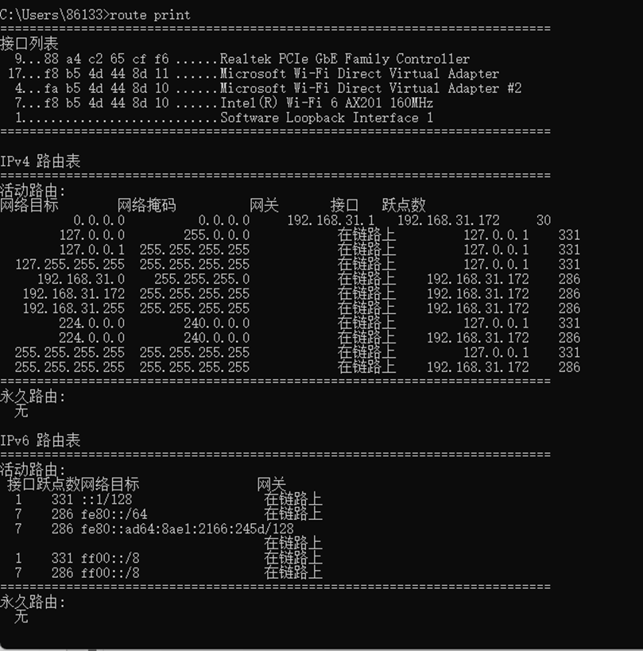 |
| netstat | 显示已经与本机建立TCP连接的端口、IP地址、连接状态等信息 | `netstat -n` | 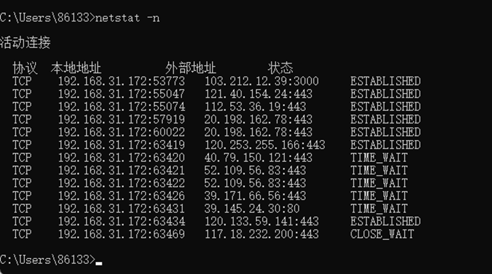 |
| NET SHARE | 显示局域网范围内某台机器的共享资源 | `NET SHARE` | 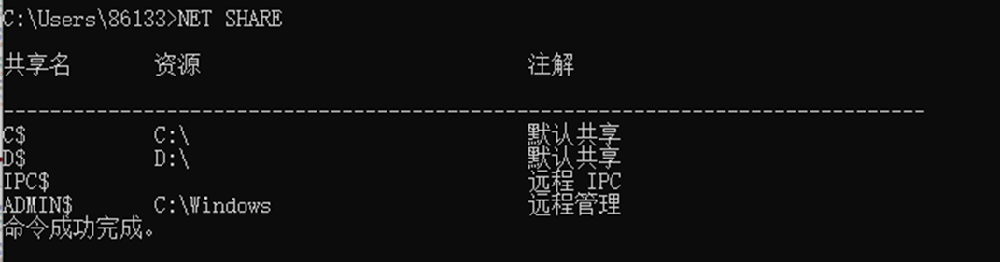 |
| telnet | 连接WEB服务器的端口获得该网站的主页内容 | `telnet xxx` `GET / HTTP/1.1` `HOST:xxx` | 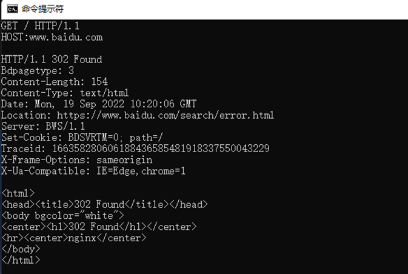 |

### 2.1 你的任务

1. 运行以上表格中所有的命令示例（ 11 个功能，route 相关命令有两个需要运行）。
2. 观察使用 `ping`, `tracert`, `nslookup`, `telnet` 指令时 WireShark 中出现的数据包并捕获，观察他们的协议类型。
3. 观察哪些命令使用时会有数据包产生，并探索原因。
4. 探索 `ping` 命令会发送怎样的数据包，何时会出现 ARP 信息。探索 `ping` 域名和 `ping` IP 地址时，二者产生的数据包有何不同。
5. 详细任务内容可在实验报告模板中查看，实验结果截图放在最终实验报告中提交。

!!! note "提示 & 要求"
    - 示例中出现的 `xxx` 表示某个域名/IP地址，可任意选择，尽可能选择同图片示例不同的内容。`mmm` 表示子网掩码，`yyy` 表示网关。
    - 在使用 `route add` 指令添加完路由后，请用 `route print` 指令重新打印一遍本机并指出你添加的路由位置。
    - 在使用 WireShark 观察命令发送的数据包时（你的任务2.1.2），若后台运行了浏览器或其他联网程序，WireShark 中抓的包会非常多，此时会影响我们判断哪些包是我们输入的命令所产生的。因此，我们建议：
        1. 尝试关掉后台应用，包的数量会减少很多
        2. 在选择 IP 地址的时候，选择特异性的 IP 地址。例如 `ping 8.8.8.8`，此时抓到的包目的/源地址就是这个。  
            你也可以搜寻其他的一些公共 DNS 或公共 IP，这可以保证你的电脑一定能连通。  
            而由于指令功能不同，不一定所有指令产生包的源/目的地址都是你输入的地址，请大家自行探索。
        3. 在包的具体信息栏目中有些会带上这个包的来源指令，如 `ping`，你可以用这个判断哪些包是你的指令产生的。

!!! quote ""
    以上命令也存在其他参数，-n -r 等以实现不同功能，大家可以自行探索更多用途。

!!! warning "注意"
    - `route add` 操作可能会报错：“请求时操作需要提升”，需要以管理员身份打开 `cmd` 或 `powershell`。
    - 部分电脑输入 `telnet` 指令成功连接后会进入黑色窗口，此时输入键盘可能并不会显示在终端上，但后台仍然在读入。可以盲打指令进行下一步操作，输入完成后需要键入两次回车才算完毕。
    - 在执行 `telnet` 指令时可能遇见类似报错：“telnet不是内部指令”，可参考[win10 telnet不是内部或外部命令（已解决）](https://blog.csdn.net/qq_36292543/article/details/119645130)
    - 若出现类似报错：“23端口连接失败”，可以在切换其他端口（如80等）重试。在命令 `telnet xxx` 后加上端口号即可，即 `telnet xxx yy`，yy指端口号。  
      若仍不行，可考虑下载 telnetSetup.exe 重启：[win10 Telnet服务器 解决telnet正在连接127.0.0.1...无法打开到主机的连接 在端口 23: 连接失败](https://blog.csdn.net/qq_43779149/article/details/119141334)
    - 若仍无法连接，可考虑：[Telnet访问百度www.baidu.com_alicee_2012的博客-CSDN博客_telnet 百度](https://blog.csdn.net/alicee_2012/article/details/123128099)
