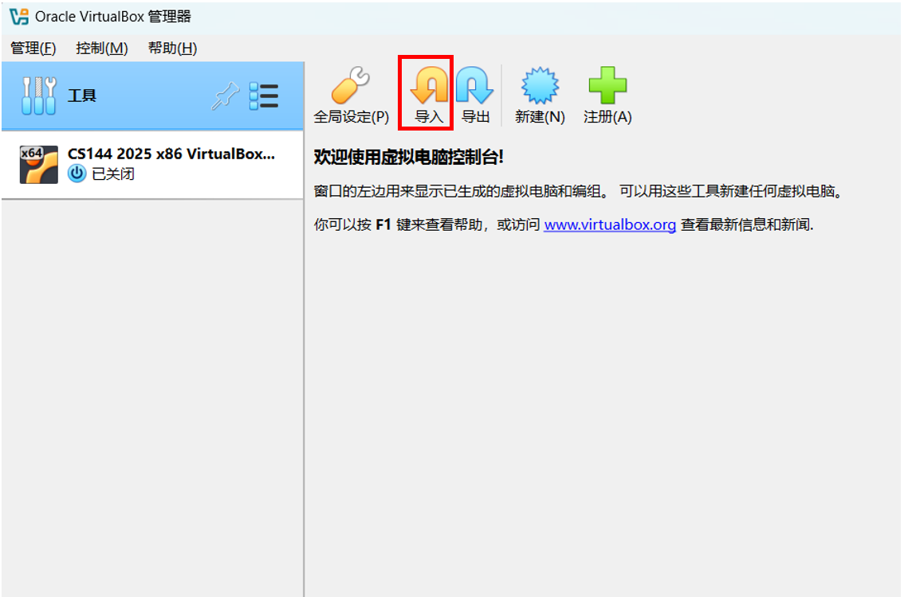
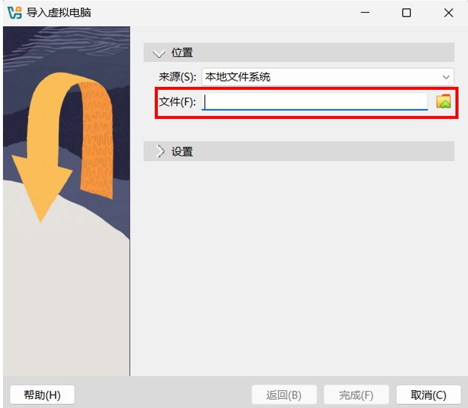
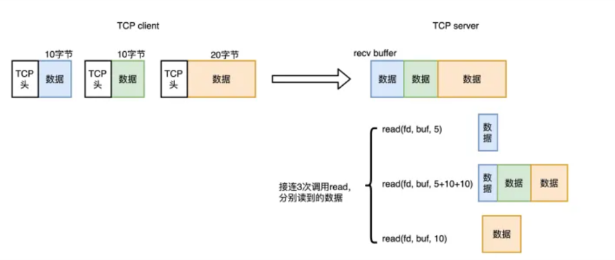

# Lab2 Webget 与字节流（ByteStream）

!!! warning "注意"
	实验报告提交 ddl 为 2025 年 10 月 26 日 23:59，请同学们留意。

!!! note "说明"
	Lab2-5与CS144的实验内容对齐，我们将实现一个完整的TCP/IP协议栈。

## 1 环境配置

为了避免不必要的问题，我们推荐你使用虚拟机和CS144官方提供的镜像完成实验。

### 1.1 安装VirtualBox虚拟机并下载虚拟机镜像

VirtualBox：<https://www.oracle.com/cn/virtualization/virtualbox/>

虚拟机镜像：<https://stanford.edu/class/cs144/vm_files/cs144-fall-2025-x86.ova> （很大的文件，建议预留1-2小时下载）


!!! warning "注意" 
	如果你有一台2020-24的MacBook（带有ARM64M1芯片），VirtualBox将无法成功运行，请安装UTM虚拟机和ARM64虚拟机映像
	

	UTM：<https://mac.getutm.app/>
	
	ARM64虚拟机镜像：<https://web.stanford.edu/class/cs144/vm_files/cs144-fall-2025-arm64.utm.tar.gz>

### 1.2 导入CS144镜像

启动 **VirtualBox** ，你会看到如下界面：



点击“导入”，打开如下窗口。输入或选择你的 **cs144_vm.ova** 镜像文件。默认设置不需要改变，点击“完成”导入镜像。



在左侧选择刚刚导入的虚拟机，点击启动。


虚拟机将启动到文本界面，你的用户名是 cs144，默认密码也是 cs144。

### 1.3 连接你的虚拟机

我们推荐你使用 **ssh** 连接你的虚拟机，你可以将你的虚拟机使用 ssh 集成在 vscode 来进行编辑。虚拟机镜像已设置后，VirtualBox 会将主机上 localhost:2222 的 TCP 连接转发到虚拟机的 22 号端口 (ssh)。虚拟机运行时，你可以按如下方式连接：

```bash
ssh -p 2222 cs144@localhost
```

### 1.4 安装所需的包

下面这些命令会安装实验中需要用到的包：

```bash
sudo apt update && sudo apt install git cmake gdb build-essential clang \
clang-tidy clang-format gcc-doc pkg-config glibc-doc tcpdump tshark libpcap-dev
```

## 2 使用网络

在正式进行编码工作之前，我们首先使用应用层程序访问一个网页。

### 2.1 浏览器访问一个网页

在一个浏览器中，访问  <http://cs144.keithw.org/hello> ，你将会看到如下的结果。浏览器是典型的应用层程序，它会帮你构造符合 **HTTP** 协议的请求，发给服务器，然后把响应解析渲染成网页。


### 2.2 利用telnet抓取一个网页

**Telnet** 也是应用层程序，只不过当你使用 telnet 连接到服务器时，需要手动输入 HTTP 报文。


1. 在你的虚拟机中运行 `telnet cs144.keithw.org http [Enter]` 命令。它告诉 telnet 程序在你的计算机与另一台计算机（名为**cs144.keithw.org** ）之间打开一个可靠的字节流，并在这台计算机运行一个特定的服务：“http”服务。如果你的虚拟机已经被正确设置且连接网络，你将会看到
```
$ telnet cs144.keithw.org http
Trying 104.196.238.229...
Connected to cs144.keithw.org.
Escape character is '^]'.
```
按住 `Ctrl` 并按下 `]`，接着输入 `close` 退出。

2. 输入 `GET /hello HTTP/1.1 [Enter]` ，这告诉服务器URL的路径部分。
3. 输入 `Host: cs144.keithw.org [Enter]` ，这告诉服务器URL的主机部分。
4. 输入 `Connection: close [Enter]` ，这告诉服务器你已经完成了请求，服务器将在回应后断开连接。
5. 多输入一次 `[Enter]` ，发送一个空行并告知服务器你已经完成了输入。

!!! warning "注意"
	输入这几条指令时一定要快，不然连接会断掉。

输入成功后，你将会看到与浏览器展示的结果相同的回复。

```
GET /hello HTTP/1.1
Host: cs144.keithw.org
Connection: close

HTTP/1.1 200 OK
Date: Thu, ...
Server: Apache
Last-Modified: Thu, 13 Dec 2018 15:45:29 GMT
ETag: "e-57ce93446cb64"
Accept-Ranges: bytes
Content-Length: 14
Connection: close
Content-Type: text/plain

Hello, CS144!
Connection closed by foreign host.
```

## 3 Webget

如果你继续探索上述两个应用层程序，你会发现它们都建立在 **socket** 之上。Socket（套接字），是传输层提供给应用层的接口，对于应用层而言，是对TCP/UDP这些传输层协议的抽象封装。应用层程序通过 socket 建立连接，发送和接受数据。在这一章中，你将编写一个简短的应用层程序：**webget**，调用Linux内核提供的 **stream socket** 类来实现。

### 3.1 建立仓库

1. 在你的虚拟机上，输入 `git clone https://github.com/sibo715/zju-comnet-labs.git [Enter]` 来抓取项目初始代码文件。
2. 输入 `cd zju-comnet-labs [Enter]` 进入项目目录。
3. 输入 `mkdir build [Enter]` 构建 build 目录。
4. 输入 `cd build [Enter]` 进入 build 目录。
5. 输入 `cmake .. [Enter]` 搭建系统。
6. 输入 `make [Enter]` 命令编译源代码。（这里注意你每次对项目进行了修改都需要重新运行 `make` 命令） 

!!! note "提示"
	由于http连接github时常不稳定，我们推荐使用ssh来管理你的git仓库，可参考 <https://zhuanlan.zhihu.com/p/628727065>

### 3.2 OS Stream Socket

Linux内核提供了  **stream socket** ，它像一种文件描述符。当两个 stream socket 连在一起时，写入其中一个socket的字节最终将被另一个socket以相同的顺序读出。下图描述的是基于TCP/IP协议的 Client-Server 通信流程。

- 服务器端是等待连接并提供服务的程序

  	- socket: 创建一个套接字，这是网络通信的端点
		
  	- bind: 将套接字和一个本地地址（IP地址和端口号）绑定
		
  	- listen: 使套接字进入监听状态，等待客户端的连接请求
		
  	- accept: 阻塞等待客户端连接。一旦接收到一个连接请求，它会创建一个新的套接字来处理这个客户端的通信
		
  	- while(true): 表示服务器通常会进入一个**循环**，不断地调用 `accept` 来等待并处理新的客户端连接
		
  	- read/write: 与已连接的客户端进行**数据读取和写入**的通信
		
  	- close: 关闭与当前客户端通信的套接字

- 客户端是发起连接并请求服务的程序

  	- socket: 创建一个套接字
  	- connect: 向服务器端的特定地址和端口**发起连接**。一旦连接成功，就可以开始数据传输
  	- write/read: 通过已建立的连接向服务器**发送数据（write）和从服务器接收数据（read）**
  	- read EOF: 客户端读取到**文件结束符**，表明服务器关闭了连接或关闭了写入端
  	- close: 关闭套接字，终止与服务器的连接


### 3.3 实现 **webget**

请阅读 `libsponge/util/socket.hh` 和 `libsponge/util/file_descriptor.hh` 的 public interfaces（请注意 **Socket** 继承于 **FileDescriptor**，**TCPSocket** 继承于 **Socket** ） 。熟悉 socket 各接口的定义以及如何调用。

现在我们要调用 TCPSocket 的接口来实现 webget 这个应用层程序 ，就像前面的 `telnet` 一样用于抓取网页。

1. 在编辑器中打开 `/path/to/zju-comnet-labs/apps/webget.cc` 。

2. 完成 **get_URL** 函数（请使用 **HTTP**请求的格式并使用 **TCPSocket** 和 **Address** 类）。具体来说，你需要通过socket建立连接，写入请求并最终读出返回的数据。

    !!! warning "注意" 
        - 在HTTP中，每行必须以“\r\n”结尾。

        - Connection:close这句代码必须包含在客户端的请求中。
        
        - 确保从服务器读取和打印所有的输出，直到套接字到达“EOF”，即文件的末尾。

3. 使用 `make` 重新编译你的项目。

4. 输入 `/path/to/zju-comnet-labs/build/apps/webget cs144.keithw.org /hello [Enter]` 来测试你的程序。

5. 如果你觉得上面的输出结果是正确的，你可以输入 `make check_webget [Enter]` 进行自动测试（测试样例路径：`/path/to/zju-comnet-labs/tests/webget_t.sh`）。

    !!! warning "注意" 
    	如果这里显示timeout，记得关闭vpn

在完成 **get_URL** 函数后，你将看到如下的结果：

```
$ make check_webget
[100%] Testing webget...
Test project /path/to/zju-comnet-labs/build
    Start 31: t_webget
1/1 Test #31: t_webget .........................   Passed    1.19 sec

100% tests passed, 0 tests failed out of 1

Total Test time (real) =   1.19 sec
[100%] Built target check_webget
```

## 4 可靠的字节流

在前一章节中，我们已经调用 socket 接口完成了简易的 webget 应用程序。在这一章中，我们将实现一个简化版的 socket 读写缓冲区（ByteStream）。如下图所示，在建立连接后，TCP会维护发送（send）和接收（recv）两个缓冲区。以recv缓冲区为例，client发送给server的数据将依次写入缓冲区，而server可以按需读取所需的数据。



在这一章中，你将自己动手实现一个字节流。字节在“输入”端写入，并可以按照相同的顺序从“输出”端读取。**writer** 可以结束输入，之后不能再写入任何字节。**reader** 读到流的末尾时，会遇到 **EOF** （end of file），之后不会再读取任何字节。

你的字节流同时也要考虑容量控制，意味着它将在初始化时给定一个容量（capacity）：可以存入内存的最大字节数。你的字节流需要根据这个容量限制 **writer** 的写入，达到容量后不能继续写，而当 **reader** 从流中读出字节时，**writer** 才能继续写。

打开 `libsponge/byte_stream.hh` 以及 `libsponge/byte_stream.cc` 文件，设计私有成员并完成接口的实现。接口可以分为4类：

1. 构造函数 
```c++
ByteStream(const size_t capacity); // 初始化所有需要的私有成员（自己设计并添加）
```
2. Writer
```c++
size_t write(const std::string &data) //将data尽可能多地写入stream，返回写入stream的字节数。
size_t remaining_capacity() const //返回stream中剩余空间的字节数。
void end_input() //若stream达到容量上限，则私有变量赋值true
void set_error() { _error = true; } //若stream遇到错误，则私有变量_error赋值true
```
3. Reader
```c++
std::string peek_output(const size_t len) const //返回len长度的str
void pop_output(const size_t len) //从stream中pop出长度为len的str
std::string read(const size_t len) //先peek再pop
bool input_ended() const //若输入结束则返回true
bool error() const { return _error; } //如果stream遇到error，则返回true
size_t buffer_size() const //返回当前可以从stream中读取的最大长度的str
bool buffer_empty() const //如果stream当前空了，返回empty
bool eof() const; //如果输入结束且输出达到末尾，返回true
```
4. General Accounting
```c++
size_t bytes_written() const; //总共写入的字节数
size_t bytes_read() const; //总共pop出的字节数
```


当你开发完成并重新编译项目后，你可以输入 `make check_lab0 [Enter]` 进行自动测试。你将看到如下的结果：

```
$ make check_lab0
[100%] Testing Lab 0...
Test project /path/to/zju-comnet-labs/build
    Start 26: t_byte_stream_construction
1/9 Test #26: t_byte_stream_construction .......   Passed    0.00 sec
    Start 27: t_byte_stream_one_write
2/9 Test #27: t_byte_stream_one_write ..........   Passed    0.00 sec
    Start 28: t_byte_stream_two_writes
3/9 Test #28: t_byte_stream_two_writes .........   Passed    0.00 sec
    Start 29: t_byte_stream_capacity
4/9 Test #29: t_byte_stream_capacity ...........   Passed    0.25 sec
    Start 30: t_byte_stream_many_writes
5/9 Test #30: t_byte_stream_many_writes ........   Passed    0.00 sec
    Start 31: t_webget
6/9 Test #31: t_webget .........................   Passed    1.09 sec
    Start 53: t_address_dt
7/9 Test #53: t_address_dt .....................   Passed    0.01 sec
    Start 54: t_parser_dt
8/9 Test #54: t_parser_dt ......................   Passed    0.00 sec
    Start 55: t_socket_dt
9/9 Test #55: t_socket_dt ......................   Passed    0.00 sec

100% tests passed, 0 tests failed out of 9

Total Test time (real) =   1.38 sec
[100%] Built target check_lab0
```

!!! note "提示"
	若仍然对接口的实现逻辑不清楚的，可以查看测试样例从而加深理解。
	
 	- `/path/to/zju-comnet-labs/test/` 下的 `byte_stream_test_harness.hh` 和 `byte_stream_test_harness.cc` 是所有测试方法的声明和实现。
 	
 	- `/path/to/zju-comnet-labs/byte_stream_xxx.cc` 为测试样例
