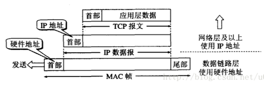
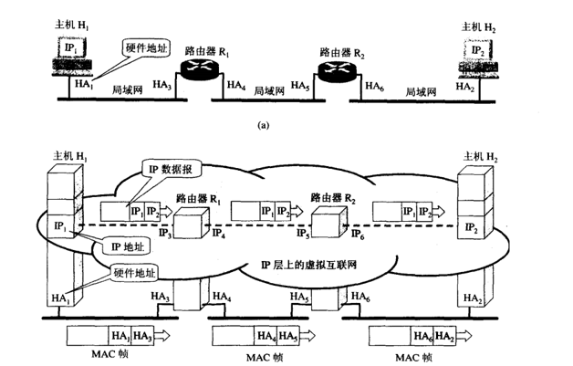
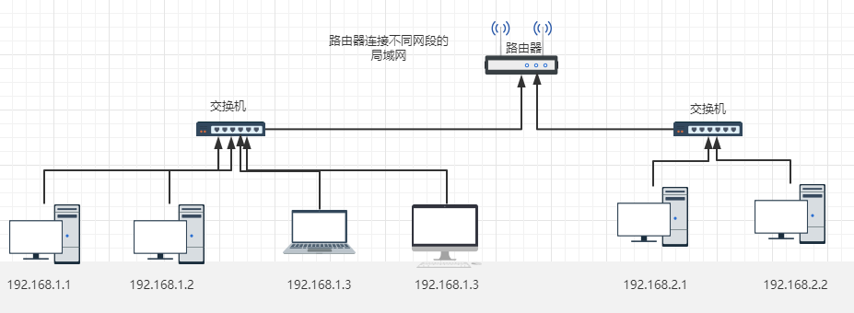

# Lab3 网络接口与IP路由器  

!!! warning "注意"
	实验报告提交 ddl 为 2025 年 11 月 9 日 23:59，请同学们留意。

## 1 引言

在上一次实验中，我们熟悉了 socket 的一些接口，比如 `connect()`，`write()`，`read()` 等，并实现了一个简化版的 socket 读写缓冲区（ByteStream）。为了与课程进度保持对齐，我们暂时将 TCPReceiver/Sender 和 TCPConnection 的实现放到后面的两次实验。在本次实验中，我们将聚焦于**网络层与链路层的交互**。我们将实现：

- 网络接口（Network Interface），为每个目标 IP 地址查找对应的以太网地址，即实现地址解析协议（ARP）
- 简易路由器（Router），对于给定的数据报，确认发送接口以及下一跳的IP地址

## 2 网络接口

在这一章节中，我们将实现网络接口类，对数据报进行发送和接收。首先，我们先要了解什么是 MAC 地址，以及我们为什么需要 MAC 地址。

### 2.1 IP地址与MAC地址

IP地址是网络层和以上各层使用的地址，是一种逻辑地址（IP地址使用软件实现的），而MAC地址是数据链路层和物理层使用的地址，是与网卡硬件绑定的地址，在出厂时由制造商写入，因此被称为物理地址或硬件地址。如下图所示，在源主机发送数据时，数据从高层到低层依次封装，然后才到通信链路上传输。比如，网络层中使用IP地址的数据报一旦交给了数据链路层，就被封装成了MAC帧。



如下图所示，在链路层，MAC帧在传送时使用的源地址和目的地址都是MAC帧首部的硬件地址，而看不到隐藏在MAC帧负载中的IP地址。在目标主机接收MAC帧后，只有在剥去MAC帧的首部和尾部后把MAC层的数据交给网络层后，网络层才能在IP数据报的首部中找到源IP地址和目的IP地址。这就是为什么我们在发送和接收数据时需要先找到目标主机的MAC地址。 



### 2.2 地址解析协议（ARP）

那我们如何找到目标IP对应的MAC地址呢？这就需要用到 **地址解析协议**（Address Resolution Protocol）。所谓地址解析（address resolution）就是主机在发送帧前将目标IP地址转换成目标MAC地址的过程，如下图所示。


深入ARP协议来看，每一个网络接口都会维护一个ARP缓存表，表中的IP地址与MAC地址是一一对应的，如下表。当主机A要向本局域网上的某个主机B发送IP数据报时，就先在其ARP缓存表中查找有无主机B的IP地址。如果有，就在ARP缓存表中查出其对应的硬件地址，再把其硬件地址写入到MAC帧，然后通过局域网把该MAC帧发往此硬件地址。如果没有，则在本局域网上广播发送一个ARP请求分组。主机B在ARP分组中见到自己的IP地址就向A发送ARP响应分组（单播）。主机A收到主机B的ARP响应分组后，就在其ARP缓存表中写入主机B的IP地址到硬件地址的映射。另外，ARP缓存表采用老化机制，为了防止表项陈旧、节省空间，表中的每个条目在插入时被赋予固定寿命（如 30,000 ms），超时后，条目被直接删除。

| 主机名称 | IP 地址       | MAC 地址          |
| -------- | ------------- | ----------------- |
| A        | 192.168.38.10 | 00-AA-00-62-D2-02 |
| B        | 192.168.38.11 | 00-BB-00-62-C2-02 |
| C        | 192.168.38.12 | 00-CC-00-62-C2-02 |
| D        | 192.168.38.13 | 00-DD-00-62-C2-02 |
| E        | 192.168.38.14 | 00-EE-00-62-C2-02 |
| ...      | ...           | ...               |

### 2.3 实现网络接口类

在实现之前，你需要：

- 阅读 `libsponge/tcp_helpers/ethernet_frame.hh` 和 `libsponge/tcp_helpers/ethernet_header.hh`，了解如何组装一个以太网帧

```c++
EthernetFrame frame;
frame.header().src = ?;
frame.header().dst = ?;
frame.header().type = ?;
frame.payload() = ?;
```

- 阅读 `libsponge/tcp_helpers/ipv4_datagram.hh` 和 `libsponge/tcp_helpers/ipv4_header.hh`，了解如何序列化一个数据报作为以太网帧的负载和如何解序列化来读出数据报

- 阅读 `libsponge/tcp_helpers/arp_message.hh`，了解如何组装一个ARP Message和如何对其进行序列化和解析

```c++
ARPMessage arp_request;
arp_request.opcode = ?;
arp_request.sender_ethernet_address = ?;
arp_request.sender_ip_address = ?;
arp_request.target_ethernet_address = ?;
arp_request.target_ip_address = ?;
```

你需要实现 `libsponge/network_interface.hh` 和 `libsponge/network_interface.cc` 两个文件。你所实现的网络接口需要满足以下功能：

- 通过数据报组装以太网帧并查表发送。如果表中没有，则广播ARP请求。此时你待发送的数据报可以加入缓存队列中，当收到ARP回复时，将缓存队列中的数据报依次发送。注意ARP请求保存的时间设置为5s，超时需要重新发送
- 接收以太网帧。如果是IP数据报，直接传递给网络层。如果是ARP，你需要将源IP和源MAC地址的映射存入ARP表。并根据ARP的类型进行相应的回复
- ARP表所有的表项有30s的缓存时间，超过后需要清除已过期的表项

具体来说，你需要在 .hh 文件中加入所需要的成员变量，和在 .cc 文件中实现三个方法：

```c++
void NetworkInterface::send_datagram(const InternetDatagram &dgram, const Address &next_hop); 
// 如果目标以太网地址已经在ARP缓存表中，创建一个类型为EthernetHeader::TYPE_IPv4的以太网帧，将序列化的数据报设置为负载，并设置源硬件地址和目标硬件地址，立即发送。
// 如果目标以太网地址未知，则组装ARP请求分组，将序列化后的请求分组作为以太网帧的负载，广播请求下一跳的以太网地址。除此之外，你需要记录这个IP并保存对应的数据报（排队等待），以便在收到ARP应答后发送。注意ARP请求保存的时间设置为5s，超时需要重新发送。

optional<InternetDatagram> NetworkInterface::recv_frame(const EthernetFrame &frame); 
// 首先如果目标MAC地址不是该网络接口的地址且也不是广播地址，则直接丢弃。
// 如果MAC帧是IPv4，将有效负载解析为InternetDatagram（调用parse()），如果成功（即parse()方法返回ParseResult::NoError），将结果InternetDatagram返回给调用者。
// 如果入站帧是ARP，将负载解析为ARPMessage。若成功，记住发送者的IP地址和以太网地址之间的映射关系30秒。
// 另外，如果它是一个ARP请求分组，发送一个适当的ARP回复。
// 如果他是一个ARP回复分组，则将之前保存的IP数据报依次发送。

void NetworkInterface::tick(const size_t ms_since_last_tick); 
// 检查ARP缓存表中的每一表项，终止已过期的表项，其余表项的剩余时间减少ms_since_last_tick。
// 检查各项ARP请求，如果已过期，则清除，下次需要重新请求，其余请求的剩余时间减少ms_since_last_tick。
```

当实现完成并重新编译项目后，你可以在 `build/` 文件夹下输入 `ctest -V -R "^arp" [Enter]` 来进行测试。如果你的实现是正确的，你将看到如下的输出：

```
$ ctest -V -R "^arp"
UpdateCTestConfiguration  from :/path/to/zju-comnet-labs/build/DartConfiguration.tcl
UpdateCTestConfiguration  from :/path/to/zju-comnet-labs/build/DartConfiguration.tcl
Test project /path/to/zju-comnet-labs/build
Constructing a list of tests
Done constructing a list of tests
Updating test list for fixtures
Added 0 tests to meet fixture requirements
Checking test dependency graph...
Checking test dependency graph end
test 32
    Start 32: arp_network_interface

32: Test command: /path/to/zju-comnet-labs/build/tests/net_interface
32: Working Directory: /path/to/zju-comnet-labs/build
32: Test timeout computed to be: 10000000
32: DEBUG: Network interface has Ethernet address ea:29:0b:b1:3e:ea and IP address 4.3.2.1
32: DEBUG: Network interface has Ethernet address b2:41:4b:b9:a7:80 and IP address 5.5.5.5
32: DEBUG: Network interface has Ethernet address d6:f4:18:dd:0e:cd and IP address 5.5.5.5
32: DEBUG: Network interface has Ethernet address 1a:14:0c:94:ed:0b and IP address 1.2.3.4
32: DEBUG: Network interface has Ethernet address c2:13:57:87:a7:91 and IP address 4.3.2.1
32: DEBUG: Network interface has Ethernet address da:03:ee:67:f0:25 and IP address 10.0.0.1
1/1 Test #32: arp_network_interface ............   Passed    0.01 sec

The following tests passed:
        arp_network_interface

100% tests passed, 0 tests failed out of 1

Total Test time (real) =   0.01 sec
```


## 3 简易路由

上一章节中我们实现了网络接口，在这一章中，我们将基于网络接口类实现网络层的简易路由。

### 3.1 路由器

路由器就是用来连接两个或多个不同的局域网的。它通常包含多个网络接口，每个接口都有自己的 IP 地址，并连接到一个局域网。每个接口的 IP 地址都属于所连接局域网的同一网段，因此它可以直接与该局域网内的主机通信。一个局域网里面的网络请求要访问外面，就需要路由器作为网关，通过路由器访问出去。具体来说，路由器首先在网络层接收数据报，检查IP是否是给自己的，是的话就接收，不是则丢弃。接下来，根据接收到的数据报的 IP 头部中记录的接收方 IP 地址，在路由表中进行查询，选择最优的网络接口将数据报进行转发。



### 3.2 路由表

路由表是路由器用于确定数据报下一步去向的一张逻辑表。它记录了网络中各种目的地址与对应的转发路径（下一跳）之间的映射关系。一张典型的路由表中，每一行（即一个路由条目）通常包含以下字段：

| 字段名称     | 含义                                 |
| ------------ | ------------------------------------ |
| **目标IP**   | 目标网络的地址，例如 `192.168.1.0`   |
| **子网掩码** | 用于确定网络前缀，如 `255.255.255.0` |
| **下一跳**   | 下一跳的IP地址                       |
| **接口号**   | 数据报通过哪个网络接口发出           |

当一个 IP 数据报到达网络层时：

1. 路由器检查数据报的**目标 IP 地址**。
2. 与路由表中的所有条目进行**匹配**。
3. 按照**最长前缀匹配（Longest Prefix Match）**原则选择最具体的路由。
4. 根据匹配到的条目，将数据报转发到对应的接口或下一跳。

> 例如：目标地址是 `192.168.1.25`
> 路由表中有：
>
> - `192.168.1.0/24` → eth0
> - `192.168.0.0/16` → eth1
>
> 系统会选择更“具体”的 `/24` 路由。

!!! note "提示"
	你可能需要将IP地址从32位整数转换为一个地址对象，或是从地址对象转换为32位整数。遇到这种情况你可以使用Address::from_ipv4_numeric方法以及Address::ipv4_numeric方法解决。

### 3.3 实现路由类

你需要实现 `libsponge/router.hh` 和 `libsponge/router.cc` 两个文件。具体来说，你需要在 .hh 文件中加入所需要的成员变量，和在 .cc 文件中实现两个方法：

```c++
void Router::add_route(const uint32_t route_prefix,
                       const uint8_t prefix_length,
                       const optional<Address> next_hop,
                       const size_t interface_num);
// 此方法将路由添加到路由表中，你需要在Router类中添加一个路由表作为私有成员来存储这些信息，保存路由以备以后使用，即需要修改.hh文件。之后，调用此函数，将表项存入路由表。

void Router::route_one_datagram(InternetDatagram &dgram);
// 此方法需要将一个数据报从适当的接口路由到下一跳，它需要实现IP路由器的“最长前缀匹配”逻辑，以找到最好的路由。
// 首先检查数据报的ttl是否满足，若不满足，直接丢弃。如果满足，ttl-1，并重新计算校验和（check_sum）。
// 路由器在路由表中查找数据报目的地址匹配的路由，即目的地址的最长prefix_length与route_prefix的最长prefix_length相同。在匹配的路由中，路由器选择prefix_length最长的路由。如果没有匹配的路由，则丢弃该数据报。否则，路由器将数据报从接口发送到适当的下一跳。
```

当实现完成并重新编译项目后，你可以在 `build/` 文件夹下输入 `make check_lab1` 来进行测试。如果你的实现是正确的，你将看到如下的输出：

```
$ make check_lab1
Testing Lab 1...
Test project /home/cs144/project/zju-comnet-labs/build
    Start 32: arp_network_interface
1/2 Test #32: arp_network_interface ............   Passed    0.00 sec
    Start 33: router_test
2/2 Test #33: router_test ......................   Passed    0.01 sec

100% tests passed, 0 tests failed out of 2

Total Test time (real) =   0.01 sec
Built target check_lab1
```

