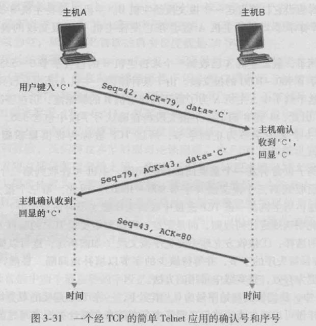
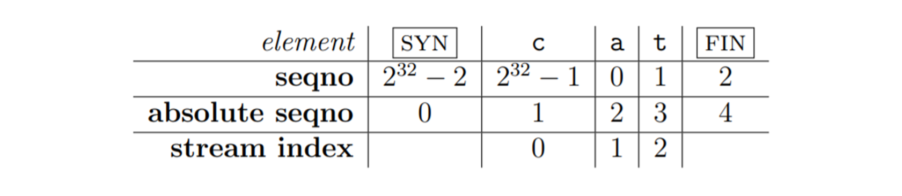

# Lab4 TCP 接收方 (Receiver) 与发送方 (Sender)

!!! warning "注意"
    实验报告提交 ddl 为 2025 年 12 月 7 日 23:59，请同学们留意。

## 1 引言

在上一次实验中，我们了解了网络层以及数据链路层的一些内容，并且我们实现了 ARP 以及实现了简易的路由器，可以简单的完成数据报发送的任务。在本次实验中，我们将聚焦于**传输层**，理解 TCP 协议的内容。我们将实现：

- 索引处理，可以正确排列多个字节流的顺序。
- TCP 接收方和发送方

## 2 TCP 协议简介

TCP（Transmission Control Protocol，传输控制协议）是传输层协议之一，它是以太网协议以及 IP 协议的上层协议，也是应用层协议的下层协议, 为应用程序提供了可靠、有序、基于字节流的通信方式。

和 IP 协议相比，IP 协议实现了多个局域网之间的数据传输，但它并不可靠，若数据在传输过程中收到干扰或者丢包，单纯的 IP 协议并不能检测或者解决。而 TCP 协议则保证了数据通信的完整性和可靠性。

### 2.1 TCP 的可靠传输机制
为使 TCP 能够在不可靠的（IP）端到端网络层之上实现可靠的传输，TCP 协议需要一些机制来实现这种可靠传输，这通常包括：

- **差错控制**：接收方需要检测何时出现了比特差错
- **接收方反馈**：发送方和接收方通常在不同端系统运行，因此发送方要了解接收方情况的唯一途径是接收方能够提供明确的反馈信息
- **重传**：接收方收到有问题的分组，或者压根没收到，发送方需要重传该分组

而在本次实验中，我们主要需要实现后两种机制。

### 2.2 TCP 首部
每个 TCP 分组都会包含一个 TCP 首部，存储了这个分组的元信息。首部具体内容如下：


我们主要介绍本次实验涉及到的部分：

- **序列号**：表示这个分组的编号。为保证安全性，每一次建立 TCP 连接都会有一个随机的初始序列号，因此序列号并不是从 0 开始
- **确认号**：表示期待收到的下一个数据包的编号
- **SYN** : 置 1 表示这个分组是整个字节流传输的开始分组
- **FIN** ：置 1 表示这个分组是整个字节流传输的结束分组
- **窗口** ：用于流量控制，表示接收方还能容纳的（愿意接受的）字节数量

### 2.3 TCP 传递示例：



1. 主机 A 发送序列号为 42 的，传递信息为单字符 `C`，同时期待 B 的下一个包序号为 79
2. 主机 B 收到了 A 发来的序号为 42 的包，同时数据只有**一**个字符，因此期待下一个包的序号为 `42 + 1 = 43`，同时发送的包的序号为 79，同时回复一条信息：`C`
3. 主机 A 收到了 B 发来的序号为 79 的包，同时数据只有**一**个字符，期待收到的下一个包序号为 `79 + 1 = 80`


!!! note "说明"
    - 假设第三步中，主机 A 始终没有收到 ACK=43 的包，则可能有两种情况：A 发送的 42 号包丢失 / B 发送的 ACK 包丢失。因此发送方需要有超时检测措施来重传失误包，通常设定一个时间阈值，被称为超时重传时间（RTO）。
    - 当 RTO 过于短时，也有可能出现：A 发送 42 号包的时间 + B 处理 42 号包的时间 + B 发送 ACK 的时间 > RTO，导致发送方始终认为超时而不断重传，因此 RTO 的设定在真实场景中需要评估衡量进行确定，甚至需要随着网络情况动态调整。

### 2.4 CS144 TCP 模块整体结构：


一个 TCP 端含有发送和接收两个子模块，从因特网获取 IP 包后，提取 IP 包的数据部分作为 TCP 包。分别传递给发送方和接收方，提取其中的 ACK、窗口、传递的信息等内容，同时编辑需要发送的信息，整合之后成为新的 TCP 包通过 IP 打包发送向因特网。

## 3 你的任务
### 3.1 流重组器和索引处理
实际使用中，需要传递的数据较多且使用 IP 传输，通常需要切片处理。而数据包在网络传输中可能丢失、重排甚至多次重传。因此需要一个**流重组器**对收到的数据包冲洗整合成一个正确顺序的、没有冗余缺损的连续字节流。

因此，你需要先阅读 `libsponge/stream_reassembler.cc` 和 `libsponge/stream_reassembler.hh`，了解流重组器的功能及实现原理。

在流重组器中，为了尽可能保存数据，其内数据结构每个字节都有一个 64 位索引（往下我们称之为绝对序列号）。而 TCP 报头中的字节索引是用 32 位的序列号循环表示的，因此需要处理两种索引之间的一个转换问题。
!!! note "说明"
    在本次实验中，主要出现了三种索引:

    - 序列号 seqno：从 ISN （初始序列号，随机）起步，包含 SYN 和 FIN，32 位循环计数 [TCP]
    - 绝对序列号 absolute seqno：从 0 起步，包含 SYN 和 FIN，64 位非循环计数 [TCP]
    - 流索引 stream index：从 0 起步，排除 SYN 和 FIN，64 位非循环计数 [StreamReassembler]

    

具体的，你需要实现 `libsponge/wrapping_integers.hh` 和 `libsponge/wrapping_integers.cc` 两个文件。具体来说，你需要实现两个方法：

```cpp
WrappingInt32 wrap(uint64_t n, WrappingInt32 isn);
//给定一个绝对序列号（64位）n 和初始序列号 isn，生成序列号（32位）

uint64_t unwrap(WrappingInt32 n, WrappingInt32 isn, uint64_t checkpoint);
//给定序列号（32位）n 、初始序列号 isn 和一个检查点 checkpoint 的绝对序列号，计算 n 对应的绝对序列号（64位）。
```

完成并重新编译项目后，你可以在 `build/` 文件夹下输入 `ctest -R wrap [Enter]` 来进行测试。如果你的实现是正确的，你将看到类似如下的输出：

```
Test project /home/cs144/zju-comnet-labs/build
    Start 1: t_wrapping_ints_cmp
1/4 Test #1: t_wrapping_ints_cmp ..............   Passed    0.00 sec
    Start 2: t_wrapping_ints_unwrap
2/4 Test #2: t_wrapping_ints_unwrap ...........   Passed    0.00 sec
    Start 3: t_wrapping_ints_wrap
3/4 Test #3: t_wrapping_ints_wrap .............   Passed    0.00 sec
    Start 4: t_wrapping_ints_roundtrip
4/4 Test #4: t_wrapping_ints_roundtrip ........   Passed    0.08 sec

100% tests passed, 0 tests failed out of 4

Total Test time (real) =   0.11 sec
```

### 3.2 TCP Receiver & Sender
你需要实现接收方和发送方两个部分。

对于 `receiver` 来说，你需要实现 `libsponge/tcp_receiver.cc` 和 `libsponge/tcp_receiver.hh` 两个文件，实现以下功能：

- 接收TCPsegment，并重新组装字节流；
- 确定应该发回发送者的信号，以进行数据确认和流量控制，即需要知道ack确认号和接收窗口。

!!! warning "注意"
    在实际的使用过程中，建立 TCP 连接需要“三次握手”，断开连接需要“四次挥手”。具体内容在理论课中会讲到。  
    但为了简便考虑，本次实验接收方与发送方的交流不需要三次握手与四次挥手，在收到 SYN 信号即视为传输开始，收到 FIN 信号即结束。

具体而言，你需要实现以下三个方法：
```cpp
void TCPReceiver::segment_received(const TCPSegment &seg);
// 判断当前是否为Listen状态（未正式建立连接，需要 syn 启动）
//    是，则判断是否为 SYN 包
//        是，获得初始序列号ISN，设置状态为SYN_RECV
//        否，则数据传输未开始，丢弃数据包
//    否，则将该数据包中payload的数据放进流重组器（调用 push_substring)，并传入FIN
// 
// !!! 注意：
// 本实验中 SYN 和 FIN 可同时置 1
// SYN 包和 FIN 包可以同时携带有具体传递的信息

optional<WrappingInt32> TCPReceiver::ackno() const;
// 判断当前是否为Listen状态
//    是，返回空
//    否，查询尚未获取到的第一个字节的流索引，将流索引转换为序列号（32位的）返回
// !!! 注意：
// 如果当前处于 FIN_RECV 状态，则还需要加上 FIN 标志长度

size_t TCPReceiver::window_size() const;
// 计算总容量_capacity与流重组器_reassembler中已存数据量( _out_put )的差值

```

而对于 `sender` 来说，你需要实现 `libsponge/tcp_sender.cc` 和 `libsponge/tcp_sender.hh` 两个文件，具体而言，你需要实现以下四个方法：
```cpp
void fill_window();
// TCPSender需要填充窗口，将输入的ByteStream读取并以TCPSegment的形式尽可能发送多的字节，【不能超过对方接收的窗口大小和TCPConfig::MAX_PAYLOAD_SIZE（1452字节）】。
// TCPSegment::length_in_sequence_space()可计算一个段所占用的序列号的总数
// 如果远程窗口大小为 0, 则把其视为 1 进行操作
// 虽然发送的数据包会被接收方拒绝，但接收方可以在反向发送 ack 包时，将自己最新的 window size 返回给发送者。若双方停止了通信，那么当接收方的 window size 变大后，发送方仍然无法得知接收方可接受的字节数量。

// 具体思路：
// 1. 如果尚未发送SYN数据包，则设置header的syn位
// 2. 设置seqno和payload
// 3. 若满足条件则增加FIN（从来没发送过 FIN 且 输入字节流处于 EOF 且 window减去payload大小后，仍可存放下 FIN，如果该包设置了syn的话，还得算上syn的大小 ）
// 4. 如果没有任何数据（没有设置syn，没有fin，没有payload），则停止数据包的发送（break）
// 5. 如果没有正在等待的数据包，则重设更新时间
//      在特定时间启动，一旦RTO结束，警报就会响起。（然后进行一些处理，比如RTO加倍等）。
//      当所有数据都被确认后，停止重传计时器。
// 6. 发送数据包并追踪（加入某个存储已发数据包的数据结构中）；更新待发送的序列号
// 7. 如果设置了 fin，则break

void tick(const size_t ms_since_last_tick);
// 遍历追踪列表，如果存在发送中的数据包，并且重传计时器超时
//     重置重传定时器
//     重传尚未被 TCP 接收方完全确认的序列号最小的段
//     如果对方接收窗口大小不为0（说明网络拥堵）
//         超时重传时间 RTO 的值加倍，即*2
//         连续重传计时器增加


void ack_received(const WrappingInt32 ackno, const uint16_t window_size);
// 如果传入的 ack 是不可靠的（ack_seqno大于next_seqno），则直接丢弃
// 遍历数据结构（用来存储发送的segment），如果一个发送的segment已经被成功接收，则
//     1. 从数据结构中将该segment丢弃
//     2. 重置重传计时器
//     3. 将RTO重置为初始值
// 重置连续重传计数器
// 更新窗口大小
// 调用fill_window继续发送数据（更新窗口大小后，接收方可能有了新的接收空间，所以应该再次发送数据）


void send_empty_segment();
// 生成并发送一个payload长度为零的TCPSegment，并且序列号设置正确，即设置完序列号直接发送即可，无需其他操作。
```

完成并重新编译项目后，你可以在 `build/` 文件夹下输入 `make check_lab2 [Enter]` 来进行测试。如果你的实现是正确的，你将看到类似如下的输出：

```
Test project /home/cs144/zju-comnet-labs/build
      Start  1: t_wrapping_ints_cmp
 1/34 Test  #1: t_wrapping_ints_cmp ..............   Passed    0.00 sec
 ...
 33/34 Test #54: t_parser_dt ......................   Passed    0.00 sec
      Start 55: t_socket_dt
34/34 Test #55: t_socket_dt ......................   Passed    0.01 sec

100% tests passed, 0 tests failed out of 34

Total Test time (real) =   2.33 sec
[100%] Built target check_lab2
```

