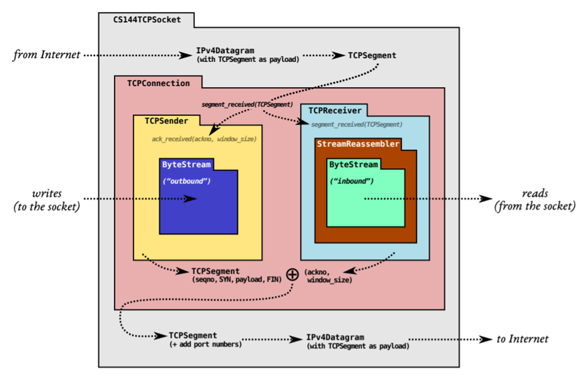
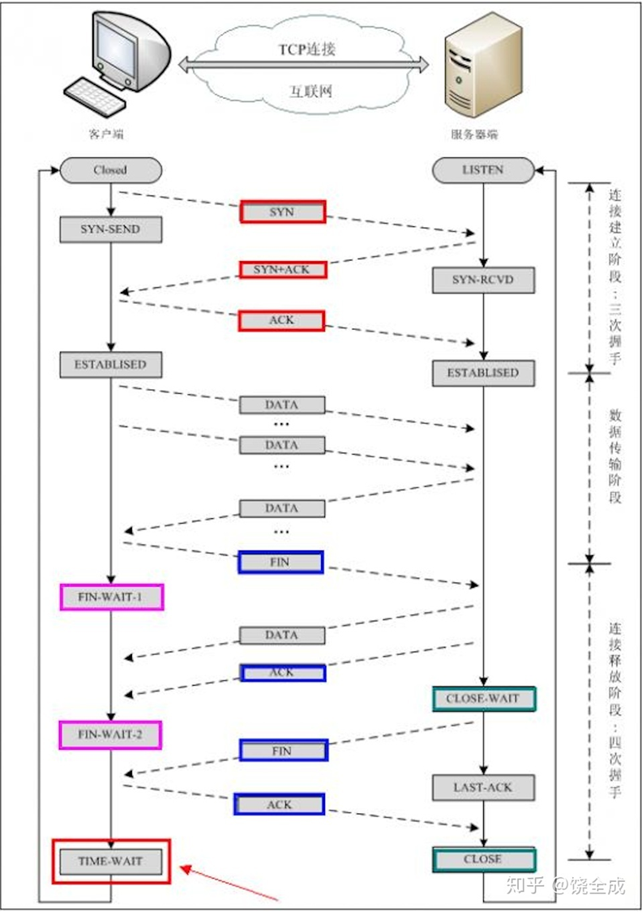
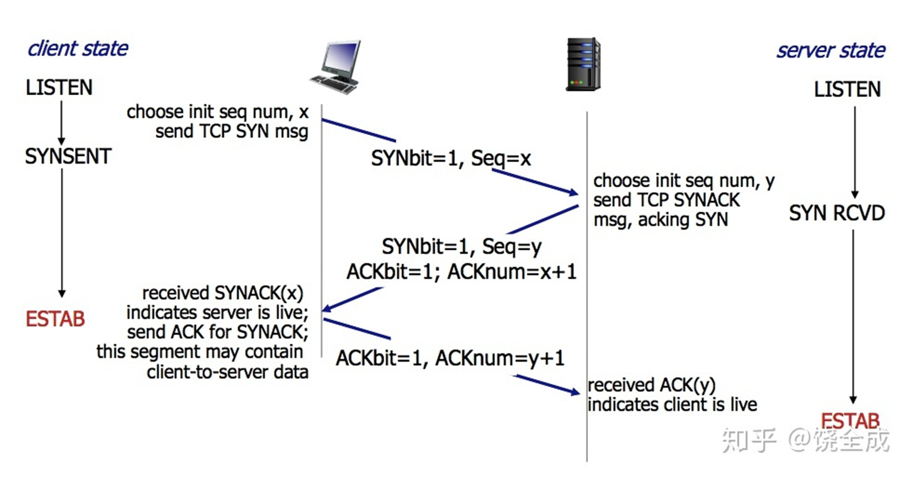
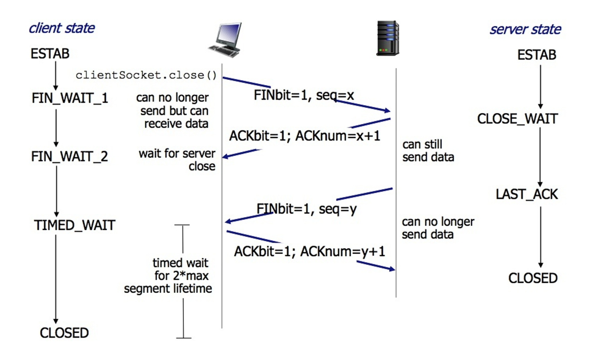
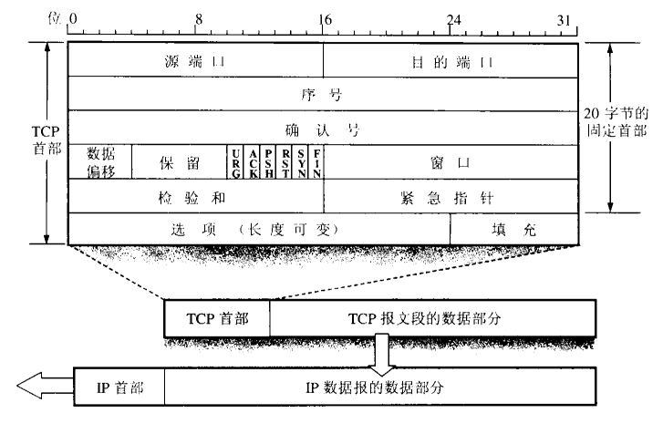
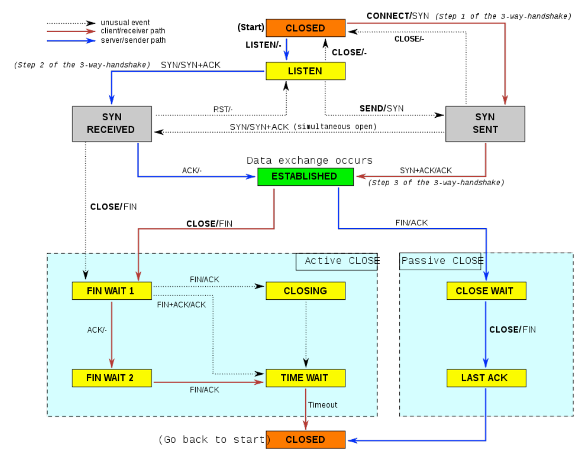
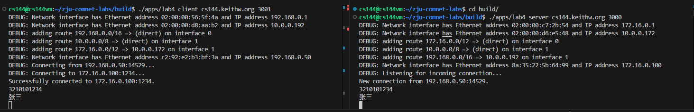

# Lab5 综合实验：完整的TCP实现
!!! warning "注意"
    实验报告提交 ddl 为 2025 年 12 月 21 日 23:59，请同学们留意。

## 1 引言

在上一次实验中，我们了解了传输层中 TCP 协议的一些内容，并且实现了 Receiver 和 Sender 模块（下图黄蓝模块），用于接收和发送 TCP 分组相关数据和信息。那么在本次实验中，我们将整合这两个子模块，实现整个 TCP Connection 模块（下图红色模块），实现客户端和服务器端互相的信息交流。具体而言我们将：

- 结合 TCP Receiver 和 Sender，同时收发数据。
- 实现 TCP Connection 的状态管理。（建立/断开连接等）
- 整合网络接口、IP路由以及TCP并实现端到端的通信



## 2 三次握手与四次挥手

TCP 作为一个面向连接的网络传输协议，其非常重要的一个特点在于建立和断开连接。而在一次连接的不同时期，终端会进入不同的状态。大致可以分成如下三个阶段：**连接建立阶段、数据传输阶段、连接释放阶段**。连接建立和释放阶段需要反复请求和确认，因此这两个过程被称作**三次握手**和**四次挥手**。



### 2.1 三次握手
在连接建立阶段，客户端、服务器端需要总计三次的请求和确认：

- 客户端发送 SYN 请求建立连接，由 LISTEN 进入 SYNSENT 状态。
- 服务器端发送 SYN + ACK 表示收到，由 LISTEN 进入 SYN RCVD 状态。
- 客户端发送 ACK 表示收到，进入 ESTAB 状态。
- （服务器端收到后进入 ESTAB 状态）



在这个过程中，双方的初始序列号也被互相确认，双方能够正确决定确认号。

!!! note "说明"
    - 为什么需要第三次握手：
        - 第三次握手可以让服务器端知晓客户端成功收到了他的初始序列号信息，因为客户端成功返回了 ACK 确认号。同时服务器端也确认了客户端确实有接收数据的能力。 
        - 假如没有第三次握手，与此同时。因为某种原因网络中漂流了一个旧的 SYN 包，那么服务器端收到这个请求就会进入 ESTAB 状态并开始等待接收数据和发送数据。但实际上这并不是客户端的连接请求，形成了一个野连接。
    - 为什么不需要第四次握手：
        - 即便第三次 ACK 丢了，但客户端在发送第三次 ACK 之后就开始了传输数据，这些数据 ACK 是始终置 1 的（确认号表示希望接收到下一个包序号，所以在传输过程中一直都有），可以作为第三次握手的替代。
        - 第三次 ACK 包丢了，服务器端也会重新发送 SYN-ACK 包，客户端收到后也会回复 ACK 包使服务器端进入 ESTAB 状态，本身也早已进入 ESTAB 状态并不影响。

### 2.2 四次挥手

在连接释放阶段，客户端、服务器端需要总计四次的请求和确认：

- 客户端发送 FIN 请求结束连接。。
- 服务器端发送 ACK 确认。
- （此时客户端仍可接收，服务器端仍可发送）
- 服务器端发送 FIN 请求。
- 客户端发送 ACK 确认。
- （客户端在发送完毕之后需要额外等待 2 * MSL 时间才能关闭）



!!! note "说明"
    - MSL 全程 Max Segment Lifetime，表示一个 TCP 报文段在被丢弃之前在网络中可能存在的最大时间，如果一个 TCP 报文段在网络中漂流的时间超过了 MSL，那么它将被路由器或者节点丢弃。
    - 为什么客户端发送 ACK 之后需要额外等待 2 * MSL 时间？
        - **为了接收可能的重传 FIN 包**。如果不等待，客户端在发送 ACK 之后直接结束。假如客户端发送的 ACK 在网络中丢失。服务器端超时未接收到 ACK 会重新发送一遍 FIN 请求，但客户端已经结束，接收到 FIN 请求会认为发生异常情况，影响实际结果。
        - **等待旧的数据包全部被丢弃**。另一方面，若不等待，客户端发送 ACK 之后直接结束。服务器端依旧由于未收到 ACK 而重发 FIN，但本次 FIN 漂流较久，久到客户端已经重新建立了新连接，此时收到一个 FIN 包，产生其他的影响。

### 2.3 RST 标志

在上面的连接建立过程里我们看到了许多极端情况，但在真实情况确实可能发生。如果确实出现意料之外的情况发生，此时客户端/服务器端就会发送 RST 包，重置整个连接。

例如，A 向 B 发送 FIN 结束请求，B 回复 ACK 时网断了，A 因种种原因关闭进程，网恢复之后又收到 B 发送的数据，A 认为是野连接于是发送 RST 强制关闭连接。

RST 标志同样在 TCP 首部中进行标识，与 SYN 标志相邻。



在本次实验中我们需要用到 RST 标志进行异常状态管理。

## 3 你的任务

### 3.1 代码实现

本次实验中你不需要实现三次握手和四次挥手，但是需要结合之前实现的 TCP Receiver 和 Sender，实现完整的一个 TCP 段模块，可以同时收发信息和状态切换。大致存在的状态切换如图所示。



具体而言，你需要实现 `libsponge/tcp_connection.cc` 和 `libsponge/tcp_connection.hh` 里的函数。主要有以下四个部分：

1. 接收部分
```cpp
void TCPConnection::segment_received(const TCPSegment &seg);
// 1. 如果设置了RST标志，将入站流和出站流都设置为错误状态，并永久终止连接。
// 2. 把这个段交给TCPReceiver，这样它就可以在传入的段上检查它关心的字段：seqno、SYN、负载以及FIN。
// 3. 如果设置了ACK标志，则告诉TCPSender它关心的传入段的字段：ackno和window_size。
// 4. 如果传入的段包含一个有效的序列号，TCPConnection确保至少有一个段作为应答被发送，以反应ackno和window_size的更新。
// 5. 如果传入的段包含一个无效的序列号，这种段被称为“keep-alive”。对方发送这种segment的目的是为了查看当前的TCP连接是否仍然有效，所以的TCPConnection应该回复这些“keep-alive”。
```

2. 发送部分
```cpp
// TCPConnection将通过网络发送TCPSegment：
// 1. TCPSender通过调用tcp_sender.cc中的函数，将一个TCPSegment添加到待发送队列中，并设置一些字段（seqno，SYN，FIN）。
// 2. 在发送当前数据包之前，TCPConnection 会获取当前它自己的 TCPReceiver 的 ackno 和 window size，将其放置到待发送 TCPSegment 中（设置window_size和ackno），并设置其 ACK 标志。

// TCPConnection 的不同函数中可能都有发送的需求，你可以自己创建新函数方便调用
```

3. 时间检测
```cpp
void TCPConnection::tick(const size_t ms_since_last_tick);
// 该方法将被操作系统定期调用，TCPConnection需要：
// 1. 告诉TCPSender时间的流逝。
// 2. 如果连续重传的次数超过上限TCPConfig::MAX_RETX_ATTEMPTS，则终止连接，并发送一个重置段给对端（设置了RST标志的空段）。
// 3. 如有必要，结束连接。（什么时候是有必要呢？下一页PPT会回答这个问题）

```

4. 决定何时结束

    - 暴力退出（unclear shutdown）：接收方收到 RST 标志或者发送方发送 RST 标志后，立即退出（设置当前 TCPConnection 的输入输出字节流的状态为错误状态，`_is_active` 立即赋值为 `false`）。可能会导致尚未传输完成的数据丢失（例如仍然在网络中运输的数据包在接收方收到 RST 标志后被丢弃）。

    - 若想让双方都在数据流收发完整后退出，即实现在没有错误情况下的结束连接，需要尽可能地确保两个字节流的每一个都已完全可靠地传递给了对方。在这种情况下，需要满足四个条件：
        1. 入站流已经全部接收完毕。
        2. 出站流已经全部发送完毕。
        3. 需要发送的数据对方已完全确认。
        4. 本地TCPConnection确信对端可以满足条件1-3后，有两种选项： 
            1. 在两个流结束后逗留 linger
            2. 被动关闭

        对于 d 而言，TCPConnection中有一个名为`_linger_after_streams_finish` 的成员变量，变量初始为 `true`。如果在出站流发送结束前（即还没有到达出站流的EOF），入站流已经全部接收完毕，则需要将此变量设置为 `false`。
        
        `_linger_after_streams_finish` 为 `true` 时对应 d.i，需要停留 10 * _cfg.rt_timeout 时间后结束

        `_linger_after_streams_finish` 为 `false` 时对应 d.ii，立即结束连接。

### 3.2 测试环节
#### 3.2.1 lab4 代码测试
完成代码并重新编译之后，你可以在 `build/` 文件夹下输入 `make check [Enter]` 来进行测试，如果你的实现是正确的，你将看到类似如下的输出：

```
Test project /home/cs144/zju-comnet-labs/build
        Start   1: t_wrapping_ints_cmp
  1/164 Test   #1: t_wrapping_ints_cmp ..............   Passed    0.00 sec

...

163/164 Test #168: t_isnD_128K_8K_L .................   Passed    0.28 sec
        Start 169: t_isnD_128K_8K_lL
164/164 Test #169: t_isnD_128K_8K_lL ................   Passed    0.67 sec

100% tests passed, 0 tests failed out of 164

Total Test time (real) =  46.21 sec
[100%] Built target check
```

#### 3.2.2 webget 模块替换测试
同时，在 lab2 中我们曾经使用现成的 TCPSocket 实现了一个简易的 webget。本次实验中我们需要使用自己实现的 TCP 替换并进行重新测试。具体而言，你需要：

- 将 `#include "socket.hh"` 替换成 `#include “tcp_sponge_socket.hh`
- 代码中的 `TCPSocket` 替换成 `FullStackSocket`
- 在 `get_URL()` 方法结尾加上 `socket.wait_until_closed()`

完成后重新编译并在 `build/` 文件夹输入 `make check_webget [Enter]` 进行测试，如果你的实现是正确的，你将看到类似如下的输出：
```
Test project /home/cs144/zju-comnet-labs/build
    Start 31: t_webget
1/1 Test #31: t_webget .........................   Passed    1.07 sec

100% tests passed, 0 tests failed out of 1

Total Test time (real) =   1.07 sec
[100%] Built target check_webget
``` 

#### 3.2.3 最终模拟终端测试
开启两个终端，分别在 `build/` 文件夹下运行：

- `./apps/lab4 server cs144.keithw.org 3000` 
- `./apps/lab4 client cs144.keithw.org 3001`

模拟服务器和客户端。成功连接之后，你可以在任意一端向对端发送信息，同时观察接收情况。最后分别运行 `Ctrl+D` 来结束连接

你可以输入任何信息作为数据模拟传输，但至少包括你的**学号和名字**。最后将输入`Ctrl+D` 结束运行之后的截图粘贴在实验报告中提交。

下图为没有运行 `Ctrl+D` 结束时的模拟传输示例


