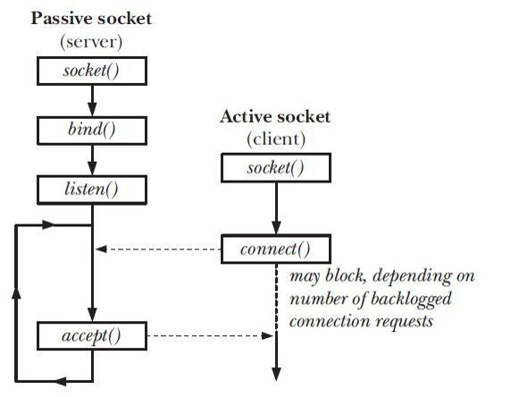

# Lab6 基于Socket接口实现自定义协议通信

!!! warning "注意"
	实验报告提交 ddl 为 2025 年 10 月 26 日 23:59，请同学们留意。

## 1 引言

在上一次实验中，我们已经完整的实现了完整的TCP协议栈。在本次实验中，我们将学习并掌握 Linux 系统所提供的 socket 接口，并基于该接口实现自定义的 client-server 通信。具体来说，我们需要基于 TCP 的简单应用层协议，完成多客户端的连接、时间/主机名查询、客户端列表和点对点消息转发。

## 2 回顾 Socket

​    Socket是在应用层和传输层之间的一个抽象层，它把TCP/IP层复杂的操作抽象为几个简单的接口供应用层调用以实现进程在网络中通信。

​    Socket起源于UNIX，是一种“打开-读/写-关闭”模式的实现，服务器和客户端各自维护一个“文件”，在建立连接打开后，可以向自己文件写入内容供对方读取或者读取对方内容，通讯结束时关闭文件。



## 3 你的任务

### 3.1 任务总览

在本次实验中，你需要根据自定义的协议规范，基于Socket编程接口设计一个客户端和服务端之间的应用通信协议。具体来说，你需要：

**开发一个客户端，实现人机交互界面和与服务器的通信**。客户端采用交互菜单形式，用户可以选择以下功能：

- 连接：请求连接到指定地址和端口的服务端

- 断开连接：断开与服务端的连接

- 获取时间: 请求服务端给出当前时间

- 获取名字：请求服务端给出其机器的名称

- 活动连接列表：请求服务端给出当前连接的所有客户端信息（编号、IP地址、端口等）

- 发消息：请求服务端把消息转发给对应编号的客户端，该客户端收到后显示在屏幕上

- 退出：断开连接并退出客户端程序

**开发一个服务端，实现并发处理多个客户端的请求**。服务端接收到客户端请求后，根据客户端传过来的指令完成特定任务：

- 向客户端传送服务端所在机器的当前时间
- 向客户端传送服务端所在机器的名称
- 向客户端传送当前连接的所有客户端信息
- 将某客户端发送过来的内容转发给指定编号的其他客户端
- 采用异步多线程编程模式，正确处理多个客户端同时连接，同时发送消息的情况

### 3.2 代码实现

#### 3.2.1 拉取代码

1. 在你的虚拟机上，输入 `git pull [Enter]` 来抓取 lab6 的代码框架。
2. 输入 `git checkout lab6-todo [Enter] ` 切换到本次实验使用的框架。

#### 3.2.2 框架说明

##### 目录结构
- `client/`：客户端逻辑。`client.cpp` 负责命令循环，`func.cpp` 里是待完成的网络交互。
- `server/`：服务器逻辑。`server.cpp` 里需要完成监听、接入、消息分发。

##### 协议说明

我们给出一个简单的通信协议定义，当然你也可以自行定义。

- 传输层：TCP。
- 报文格式：首字节为类型，后续为 ASCII 负载（可空）。常量定义如下：
  - `CONNECT (1)`：客户端发送空负载；服务器回复自身分配的客户端 ID（字符串）。
  - `TIME (3)`：客户端请求时间；服务器回复当前时间字符串。
  - `NAME (4)`：客户端请求主机名；服务器回复主机名字符串。
  - `LIST (5)`：客户端请求在线列表；服务器回复 `id1$id2$...`。
  - `MESSAGE (6)`：客户端发送 `目标id$内容`；服务器若成功则向目标下发 `SIGNAL (2)` 报文，负载同上；若目标不存在可回 `MESSAGE` 或 `INVALID (0)` 作为错误提示。
  - `DISCONNECT (7)`：客户端主动断开；服务器清理状态。
  - 其他类型可按需返回 `INVALID (0)`。

##### 你可能会用到的结构和函数

```c++
struct sockaddr_in {
     short            sin_family;    // 2 字节 ，地址族，e.g. AF_INET, AF_INET6
     unsigned short   sin_port;      // 2 字节 ，16位TCP/UDP 端口号 e.g. htons(1234)
     struct in_addr   sin_addr;      // 4 字节 ，32位IP地址
     char             sin_zero[8];   // 8 字节 ，不使用
};
struct in_addr {
     unsigned long s_addr; 	// INADDR_ANY
};

struct sockaddr{ 
　　unsigned short sa_family;     //2字节，地址族，AF_xxx
　　char sa_data[14];      //14字节，包含套接字中的目标地址和端口信息 
};

```

```c++
sockfd = socket(AF_INET, SOCK_STREAM, 0); //socket(domain, type, protocol)，如果有错误会返回-1，否则会返回一个int，代表socket的句柄

struct sockaddr_in address1;
address1.sin_family = AF_INET; // IPv4
address1.sin_port = htons(Port); //端口号
address1.sin_addr.s_addr = INADDR_ANY; //IP，INADDR_ANY表示本机IP

bind(sockfd, reinterpret_cast<sockaddr*>(&address1), sizeof(address1)); // server端绑定socket与地址结构体，用于在这个地址上进行监听

listen(sockfd, MAXPC); // server端开启监听，第二个参数是最大监听数

accept(sockfd, nullptr, nullptr); // server端同意连接

connect(sockfd, reinterpret_cast<sockaddr*>(&address1), sizeof(address1)); // client端对目标server的端口进行连接

send(sockfd, packet.c_str(), packet.size(), 0); //参数： socket句柄，内容，大小，其他信息（设为0）

char buffer[MAXBUF] = {0};
recv(sockfd, buffer, sizeof(buffer), 0); //参数： socket句柄，内容，大小，其他信息（设为0）
```

##### 需完成的核心任务
1) **客户端 `client/func.cpp`**

- `SendPacket`：组装类型字节 + 负载并 `send`。
- `ServerConnect`：创建 socket，请用户输入 IP和端口，`connect` 后设 `connected=true`，启动接收数据的子线程 `Recieve`，注意该子线程需分离或在退出时回收。
- `ServerDisconnect`/`ExitComm`：发送 `DISCONNECT`，关闭 socket，重置状态。
- `GetTime`/`GetName`/`ClientList`：调用 `SendPacket` 发送对应类型。
- `SendMessa`：用户需要在知道客户端列表的前提下，输入目标客户端 id 与消息内容，利用 `$`作为分隔符， 按 `id$内容` 构造负载并发送 `MESSAGE`。
- `Recieve`：循环 `recv`，按类型解析负载并打印提示（连接 ID、时间、主机名、列表、错误或来自其他客户端的消息 `SIGNAL` 等）。

2) **服务器 `server/server.cpp`**

- `SendPacket`：组装报文后通过指定 `sock` 发送。
- `BuildServer`：创建监听 socket，设置 `Addr` 中的端口（`Port` 需替换为你的学号后四位），`bind` + `listen`，循环 `accept`；为每个客户端创建线程 `Recieve` 并 `pthread_detach`；将 `sock` 写入 `clients`（保护互斥锁）。
- `RemoveClient`：锁保护下从 `clients` 删除并 `close`。
- `Recieve`：从客户端 `sock` 循环 `recv`。按首字节类型处理：
  	- `CONNECT`：为新连接分配 ID（可用递增计数或 `sock` 号），存入 `clients[sock]=id`，回复 `CONNECT` 负载为 ID。
  	- `TIME`/`NAME`/`LIST`：生成字符串负载后调用 `SendPacket`。
  	- `MESSAGE`：解析 `id$内容`，查找目标并转发 `SIGNAL`；找不到则向源 `sock` 返回错误。
  	- `DISCONNECT` 或 `recv` 断开：调用 `RemoveClient` 后结束线程。

!!! note "说明"
	- 请将 server端的监听端口设置为你的学号后四位。
	- 由于多个线程会同时读写 `clients` 这个共享容器，互斥锁用来防止并发访问导致数据竞争和程序崩溃。

#### 3.2.3 编译与运行
在项目根目录执行：
```bash
g++ client/client.cpp client/func.cpp -lpthread -o client/client.out
g++ server/server.cpp -lpthread -o server/server.out
```

运行顺序：

1. 先启动服务器：`server.out`（确保 `Port` 已改为个人端口，必要时在防火墙中开放）。
2. 重新开启一个终端，并启动客户端：`client.out`，根据提示输入 `connect`，在提示时填写服务器 IP（例如 127.0.0.1） 与端口。
3. 可开启多个客户端实例互相发送消息；使用 `list` 查看 ID，`message` 发送 `id` 指定消息。

当你开发完成并重新编译项目后，你将看到如下的结果：

**server启动**

```c++
[SRV] Server Building
[SRV] Server Build Successfully.
[SRV] Waiting for packs.
```

**client启动**

```c++
[SYS] Nice to meet you, dear client! (^_~)
[SYS] Welcome to use my communication service.
[SYS] Please choose one from the following services:

[HELP]
connect  Try to connect to the server.
exit     Exit from this communication.
help     Show all services for you.

[CLI] Your command:
```

**建立连接**

```c++
// client
[CLI] Your command: connect

[CONNECT]
[SYS] Please enter the IP address and port you want to connect to.
[CLI] IP address: 127.0.0.1
[CLI] Port number: Your number
[SYS] Connecting ...
[SYS] Connection Success!

[CLI] Your command: 
[SYS] Your Client ID is 4
    
// server
[SRV] Client 4 connect successfully!
[SRV] Client ID returned.
```

**查询时间/主机名/客户端列表（以时间为例）**

```c++
// client
[CLI] Your command: time

[TIME]
[SYS] Request Sending Success

[CLI] Your command: 
[SYS] Current Time is: ...
    
// server
[SRV] Receive a TIME request from client 4
[SRV] Time Sending Back Successfully.
```

**发送消息**

```c++
// 假设有两个client 4和5，现在5向4发送消息
// client 5
[CLI] Your command: message

[MESSAGE]
[SYS] Please Enter Other Clients' ID and the Message (only one line)
[CLI] Client ID: 4
[CLI] Message: hello, this is client 5.
[SYS] Message Sending Success.
    
// server
[SRV] Receive a MESSAGE request from client 5
[SRV] Message Sending Success
    
// client 4
[RECEIVE MESSAGE]
[SYS] Client 5 Just Sent A Message to you:
hello, this is client 5.
```

**断开连接/退出**

```c++
// client 
[CLI] Your command: disconnect

[DISCONNECT]
[SYS] Disconnection Success
    
// server
[SRV] Client 4 requested disconnect.
[SRV] Client 4 Disconnect Successfully.
```

